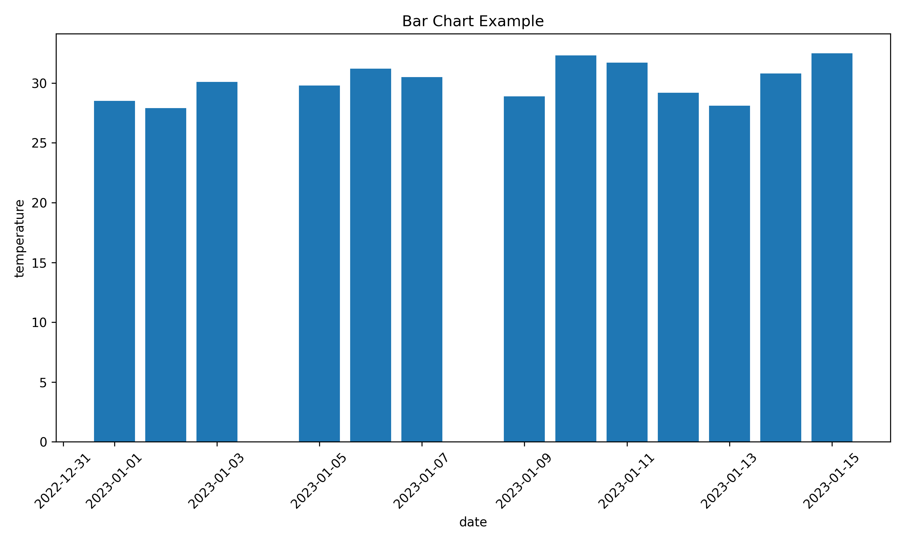
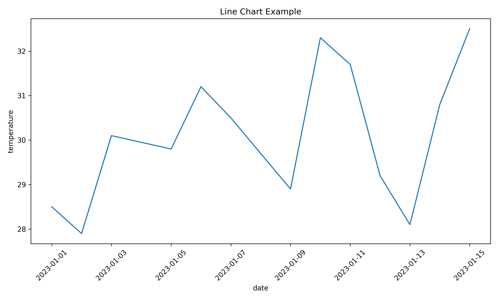
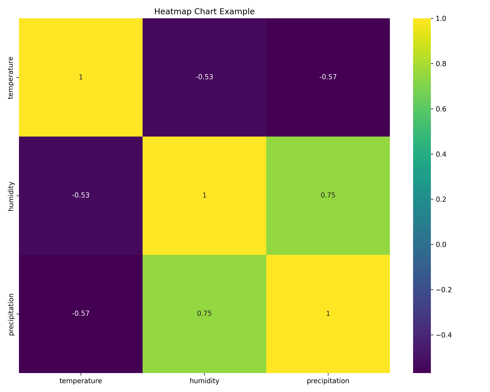

# Data Validation for Visualization

This simple project demonstrates Object-Oriented Programming (OOP) principles in Python by implementing a data validation system for visualization purposes.

## Project Structure

- `main.py`: Entry point of the application
- `validator.py`: Contains the base Validator class and specialized validators
- `data_loader.py`: Handles loading data from various sources
- `visualizer.py`: Contains classes for data visualization
- `utils.py`: Utility functions and helper classes
- `data/`: Directory containing sample datasets
- `tests/`: Simple test cases
- `reports/`: Generated reports and visualizations

## High-Level Architecture

The project demonstrates a modular architecture with clear separation of concerns:

```
main.py → data_loader.py → pandas
       → validator.py   → pandas
       → visualizer.py  → matplotlib, seaborn
       → utils.py       → pandas, numpy
```

- **main.py**: Orchestrates the entire workflow
- **data_loader.py**: Manages loading data from different sources
- **validator.py**: Provides data validation capabilities
- **visualizer.py**: Handles data visualization
- **utils.py**: Contains utility functions and helper classes

## Module Interactions in Detail

### main.py

Acts as the orchestrator of the entire process, coordinating the workflow between data loading, validation, reporting, and visualization.

**Interactions:**
- Uses **CSVLoader** from `data_loader.py` to load data
- Creates and configures **CompositeValidator** from `validator.py` with various validators
- Uses **ReportGenerator** from `utils.py` to create reports
- Initializes different visualizers from `visualizer.py` to create charts
- Uses utility functions from **DataUtility** in `utils.py` for data processing

### data_loader.py

Provides classes for loading data from different file formats into pandas DataFrames.

**Key Classes:**
- **DataLoader** (ABC): Abstract base class for all loaders
- **CSVLoader**: Loads CSV files
- **JSONLoader**: Loads JSON files
- **ExcelLoader**: Loads Excel files
- **DataLoaderFactory**: Creates appropriate loader based on file extension

**Interactions:**
- **main.py** instantiates and uses **CSVLoader** to load data
- All loaders return pandas DataFrames that are passed to validators
- **DataLoaderFactory** can be used to dynamically create the appropriate loader

### validator.py

Provides a framework for validating different aspects of data.

**Key Classes:**
- **ValidationResult**: Contains validation results, validated data, and errors
- **Validator** (ABC): Abstract base class for all validators
- **NumericValidator**: Validates numeric data with min/max constraints
- **DateValidator**: Validates date fields with format and range constraints
- **CategoricalValidator**: Validates categorical data against allowed values
- **CompositeValidator**: Combines multiple validators using the Composite pattern

**Interactions:**
- **main.py** creates a **CompositeValidator** and adds specific validators to it
- Validators process the DataFrame from **data_loader.py**
- The **ValidationResult** is passed to reporting and visualization components

### visualizer.py

Provides classes for creating different types of data visualizations.

**Key Classes:**
- **Visualizer** (ABC): Abstract base class for all visualizers
- **BarChart**: Creates bar charts
- **LineChart**: Creates line charts
- **ScatterPlot**: Creates scatter plots
- **HeatMap**: Creates heat maps
- **VisualizerFactory**: Creates appropriate visualizer based on chart type

**Interactions:**
- **main.py** creates different visualizers to display the validated data
- Visualizers use the validated DataFrame from **validator.py**
- **VisualizerFactory** dynamically creates visualizers based on the desired chart type

### utils.py

Provides utility functions and helper classes.

**Key Classes:**
- **DataUtility**: Static methods for data manipulation (outlier removal, normalization)
- **Logger**: Logging utility with singleton pattern
- **ReportGenerator**: Generates reports and statistics

**Interactions:**
- **main.py** uses **Logger** for logging throughout the process
- **ReportGenerator** creates reports based on validated data
- **DataUtility** methods are used for further data processing after validation

## Design Patterns Demonstrated

The project demonstrates several design patterns:
- **Factory Pattern**: DataLoaderFactory and VisualizerFactory create objects without specifying the exact class
- **Composite Pattern**: CompositeValidator combines multiple validators into a single validator
- **Template Method**: Validator.validate() defines the algorithm structure, deferring specific steps to subclasses
- **Strategy Pattern**: Different Visualizer implementations provide interchangeable visualization strategies
- **Singleton Pattern**: Logger ensures a single logger instance is used throughout the application

## How to Run

```bash
python main.py
```

## Learning Objectives

This project demonstrates key OOP concepts:

1. **Classes and Objects**: Building reusable components
2. **Inheritance**: Creating specialized validators from a base class
3. **Encapsulation**: Hiding implementation details
4. **Polymorphism**: Different validator types with consistent interfaces
5. **Composition**: Building complex objects from simpler ones

## Usage Example

```python
from data_loader import CSVLoader
from validator import NumericValidator, DateValidator
from visualizer import BarChart

# Load data
loader = CSVLoader("data/sample_data.csv")
data = loader.load()

# Validate data
numeric_validator = NumericValidator(columns=["temperature", "humidity"])
date_validator = DateValidator(column="date", format="%Y-%m-%d")

valid_data = numeric_validator.validate(data)
valid_data = date_validator.validate(valid_data)

# Visualize data
chart = BarChart(title="Temperature and Humidity")
chart.plot(valid_data, x="date", y=["temperature", "humidity"])
chart.show()
```

## Example Outputs

The project generates various outputs that are saved in the `reports/` directory.

### Validation Report Example

The validation report identifies issues in the data and provides statistical summaries:

```
Data Validation Report
=====================

DATA SUMMARY
------------
row_count: 13
column_count: 5
columns: ['date', 'temperature', 'humidity', 'precipitation', 'location']
missing_values: {'date': 0, 'temperature': 0, 'humidity': 0, 'precipitation': 0, 'location': 0}
numeric_columns: ['temperature', 'humidity', 'precipitation']
categorical_columns: ['location']
datetime_columns: ['date']

NUMERIC STATISTICS
------------------
temperature: {'min': 27.9, 'max': 32.5, 'mean': 30.12, 'median': 30.1, 'std': 1.55}
humidity: {'min': 62.7, 'max': 72.3, 'mean': 67.62, 'median': 67.8, 'std': 3.37}
precipitation: {'min': 0.0, 'max': 0.5, 'mean': 0.12, 'median': 0.0, 'std': 0.18}

VALIDATION ERRORS
-----------------
- Row 3: 'invalid' is not a valid number in column 'temperature'
- Row 7: 'not-a-date' is not a valid date in format '%Y-%m-%d'

VALIDATION STATUS
-----------------
Failed
```





### Visualization Outputs

The project generates multiple visualization outputs:

1. **Temperature Chart**: Line chart showing temperature over time
2. **Humidity Chart**: Bar chart showing humidity by date
3. **Temperature vs Humidity**: Scatter plot comparing temperature and humidity
4. **Correlation Heatmap**: Heatmap showing correlations between numeric variables

These visualizations help identify patterns, trends, and relationships in the validated data.
